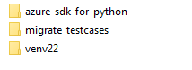
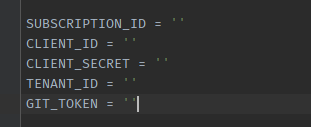

## Migrate_Testcases usage

1. download the migrate_testcases folder

2. Make sure it is in the same path as azure SDK for Python and python venv

   

3. Fill in the following four parameters if they have not been set in the environment variable

   

4. run script.
   such as :python .\migrate_testcases\main.py --path D:\dev3\azure-sdk-for-python\sdk\search\azure-mgmt-search\tests --env venv22